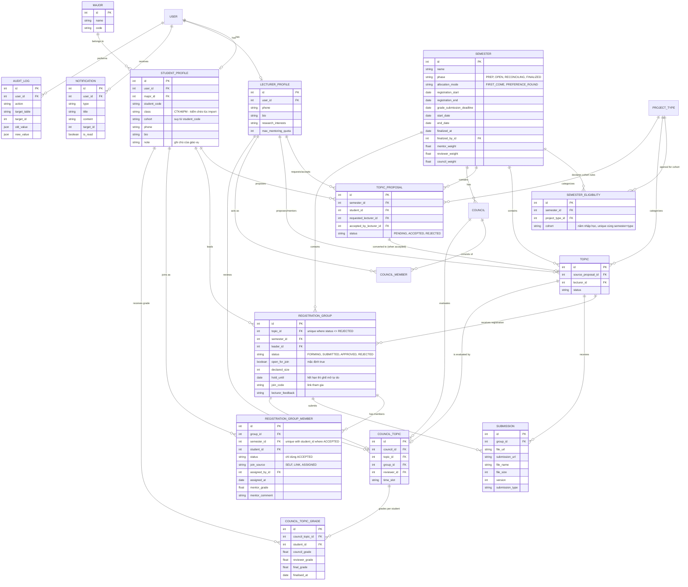

# Phân tích Thiết kế Cơ sở dữ liệu: Hệ thống Quản lý Đồ án CNTT

Hệ thống quản lý đồ án cho sinh viên Công nghệ Thông tin (bao gồm Đồ án cơ sở, Đồ án chuyên ngành, Đồ án tốt nghiệp) là một hệ thống mang tính học thuật, yêu cầu quy trình chặt chẽ từ khâu ra đề, đăng ký, thực hiện, báo cáo đến chấm điểm.

---

## 1. Phân tích Các Tính Năng Cốt Lõi (Dựa trên Role)

### 🧑‍🎓 Sinh viên (Student)

- **Quản lý đồ án**: Xem danh sách các đề tài đang mở, xem chi tiết đề tài.
- **Đăng ký**: Đăng ký đề tài (nhóm được tạo ngay trên đề tài đó) hoặc **tham gia** nhóm đang còn ghế bằng một cú click; giữ chỗ cho bạn bằng **link tham gia**. Không còn bước mời theo mã SV, và không còn bước GV duyệt từng nhóm — xem FR_STU_03a.
- **Đề xuất đề tài**: Sinh viên tự đề xuất đề tài dựa trên ý tưởng cá nhân, gửi yêu cầu cho giảng viên mong muốn hướng dẫn.
- **Thực hiện**: Quản lý tiến độ, task list, nộp báo cáo định kỳ/cuối kỳ (hỗ trợ nộp nhiều lần), nộp source code.
- **Kết quả**: Xem nhận xét của giảng viên, xem điểm, lịch bảo vệ hội đồng.

### 👨‍🏫 Giảng viên (Lecturer)

- **Quản lý đề tài**: Đề xuất đề tài mới, xem nhóm đã nhận đề tài của mình. **Không duyệt từng nhóm** — việc rà soát diễn ra một lần cho cả khoa ở pha `RECONCILING`, do **giáo vụ (Admin)** thực hiện; giảng viên chỉ được thông báo khi có SV được xếp vào đề tài của mình.
- **Duyệt đề xuất của Sinh viên**: Xem xét các đề tài do sinh viên tự đề xuất, chấp nhận làm giảng viên hướng dẫn hoặc từ chối kèm lý do.
- **Hướng dẫn**: Giao task, theo dõi tiến độ của sinh viên, tải và xem báo cáo các phiên bản.
- **Đánh giá**: Chấm điểm quá trình, nhận xét, chấm điểm phản biện/hội đồng.

### 👨‍💻 Quản trị viên (Admin)

- **Quản lý hệ thống**: Quản lý tài khoản, cấp quyền.
- **Quản lý danh mục**: Quản lý đợt/học kỳ, loại đồ án (Cơ sở, Chuyên ngành, Tốt nghiệp), chuyên ngành.
- **Quản lý quy trình**: Mở/đóng đợt đăng ký theo bốn pha học kỳ, duyệt đề tài của giảng viên (nếu cần), phân công hội đồng bảo vệ.
- **Phân bổ cuối đợt**: Sau khi cổng đóng, xếp sinh viên chưa có nhóm vào các đề tài còn chỗ rồi **chốt toàn bộ** học kỳ. Cùng loại việc với phân bổ nhóm vào hội đồng bảo vệ — đều cắt ngang toàn khoa, nên đều thuộc vai này.
- **Danh sách sinh viên toàn khoa**: một bảng duy nhất (mã SV, tên, lớp, chuyên ngành, khóa, nhóm, đề tài, GV, ghi chú) — dùng chung cho cả bàn phân bổ.
- **Báo cáo & Thống kê**: Thống kê số lượng sinh viên làm đồ án, tỉ lệ qua/trượt, danh sách điểm.

---

## 2. Thiết kế Cấu trúc Database

### Nhóm 1: Quản lý Người dùng & Phân quyền (Authentication & Profiles)

- **`users`**: `id`, `email`, `password_hash`, `role` (ADMIN, LECTURER, STUDENT), `is_active`, `created_at`, `updated_at`.
- **`student_profiles`**: `id`, `user_id` (FK), `student_code`, `full_name`, `class`, `major_id` (FK → `majors`), `cohort`, `phone`, `bio`, `note` (Text, Nullable).
  > _(cập nhật: thêm `note` — ô ghi tay tự do của giáo vụ ("bảo lưu HK1", "đã gọi điện chưa phản hồi"), hiển thị trong danh sách sinh viên toàn khoa ở FR_ADM_06. Mọi hệ thống hành chính thật đều cần một ô như vậy; không có nó thì thông tin ấy chạy sang một file Excel riêng và biến mất khỏi hệ thống.)_
  > _(cập nhật: **`class` phải được kiểm chéo lúc import, không nhận làm text tự do.** Mã lớp mang khuôn `CT` + `K{số khóa}` + `{mã ngành}` (`CTK46PM`, `CTK46MMT`), nên nó mã hoá lại đúng hai dữ kiện đã có nguồn khác: khóa (suy từ `student_code`) và chuyên ngành (`major_id`). Ba nguồn cho hai dữ kiện. Mã lớp **đúng khuôn nhưng mâu thuẫn** với hai nguồn kia → **từ chối dòng**, giống cách một dòng có email lệch mã SV đang bị từ chối; mã lớp **không khớp khuôn** (lớp chất lượng cao, lớp ghép) → nhận nhưng cảnh báo. Xem FR_ADM_01.)_
  > _(cập nhật: `student_code` gồm **2 chữ số năm nhập học + 5 chữ số thứ tự** (`2212345`) và trùng đúng phần trước `@` của email trường. `cohort` vì vậy **được suy ra từ mã**, lưu dạng năm nhập học `"2022"`, không lấy từ ô nhập tay trong file import — cột gõ tay sẽ có cả `"2021"`, `"K45"`, `"21"` lẫn ô trống, và mọi quy tắc dựa trên nó sẽ hỏng âm thầm. Import phải từ chối dòng có email và mã lệch nhau. Số khóa chỉ là cách hiển thị: `khóa = năm nhập học − 1976`.)_
  > _(cập nhật: thêm `phone`, `bio`, `major_id` FK thay cho string cứng; hỗ trợ FR_STU_01)_
- **`lecturer_profiles`**: `id`, `user_id` (FK), `lecturer_code`, `full_name`, `academic_title`, `phone`, `bio`, `research_interests`, `max_mentoring_quota` (Int - Số nhóm tối đa được hướng dẫn trong một học kỳ, Nullable — nếu Null thì không giới hạn).
  > _(cập nhật: thêm `phone`, `bio`, `research_interests`, `max_mentoring_quota`; hỗ trợ FR_LEC_01)_
  > _(cập nhật: **bỏ `department_id`** — xem ghi chú ở `majors` bên dưới. Giảng viên tìm theo `research_interests`, không theo đơn vị.)_

### Nhóm 2: Quản lý Danh mục (Master Data)

- **`semesters`**: `id`, `name`, `code`, `start_date`, `end_date`, `registration_start` (Thời điểm mở đăng ký), `registration_end` (Thời điểm đóng đăng ký), `grade_submission_deadline` (Deadline chốt điểm — sau mốc này điểm bị khóa), `is_active`, `mentor_weight`, `reviewer_weight`, `council_weight` (Float — trọng số tính điểm tổng kết, mặc định 0.4/0.3/0.3, tổng bằng 1).
  > _(cập nhật: thêm `registration_start`, `registration_end`; hỗ trợ FR_ADM_03)_
  > _(cập nhật: thêm **`phase`** (PREP, OPEN, RECONCILING, FINALIZED), **`finalized_at`** và **`finalized_by_id`** (FK → `users`, Nullable) — hỗ trợ mục 1.0 và FR_ADM_07._
  >
  > _`phase` là **cột thật, không phải phép so sánh ngày**. Suy pha thuần từ `registration_end` thì pha `RECONCILING` không bao giờ kết thúc được: không có chỗ nào ghi nhận việc phân bổ đã xong. Ngày tháng là mốc kích hoạt, cột này là sự thật. `OPEN → RECONCILING` được đẩy **lúc đọc** (lazy) nên không cần scheduler; `RECONCILING → FINALIZED` bắt buộc là một sự kiện có người bấm, và `finalized_by_id` + `finalized_at` là dấu vết của nó._
  >
  > _Không có cột `coordinator_id`, và **không có role thứ tư**: việc xếp sinh viên thuộc về vai **ADMIN (giáo vụ khoa)** đã có sẵn. Lý do là quyền hạn, không phải năng lực — một em chưa có nhóm gần như luôn phải xếp vào đề tài của thầy khác, nên không giảng viên nào nên có quyền đó. Đây cũng đúng loại việc ADMIN đã làm khi phân bổ nhóm vào hội đồng bảo vệ.)_
  > _(cập nhật: thêm 3 trọng số điểm — công thức tính điểm tổng kết là **dữ liệu theo học kỳ**, không hardcode trong code, để đổi trọng số kỳ sau không tính lại điểm các kỳ đã đóng)_
- **`project_types`**: `id`, `name`, `code`.
- **`semester_eligibilities`**: Khóa nào được làm loại đồ án nào trong học kỳ nào. _(bảng mới; hỗ trợ FR_ADM_03)_
  - `id` (PK), `semester_id` (FK), `project_type_id` (FK), `cohort` (String — năm nhập học, `"2022"`).
  - `UNIQUE(semester_id, project_type_id, cohort)`, cộng index `(semester_id, cohort)` cho câu hỏi nóng nhất: "kỳ này khóa này được làm những loại nào".
  > _(Quy tắc này là **dữ liệu do giáo vụ khai**, không suy ra từ năm học của sinh viên — suy ra sẽ sai ngay với sinh viên học chậm, học vượt, bảo lưu hoặc học lại, mà nhóm đó không hề hiếm. Bảng chịu được cả trường hợp một khóa được mở hai loại đồ án trong cùng kỳ: chỉ là hai dòng. Nó phục vụ hai chiều — lọc mặc định danh sách đề tài cho sinh viên (FR_STU_02) và **chặn ở API** khi sinh viên đăng ký đề tài không thuộc diện của khóa mình (FR_STU_03), kể cả khi giáo vụ xếp tay ở pha `RECONCILING` (FR_ADM_07).)_
- **`majors`**: `id`, `name`, `code`. Danh sách chuyên ngành **phẳng**, không phân cấp. _(bảng mới: tách riêng Chuyên ngành; hỗ trợ FR_ADM_02)_
  > _(cập nhật: **đã bỏ hẳn bảng `departments`** (bộ môn). Nó từng gom giảng viên và chuyên ngành thành nhóm, nhưng không một quy tắc nghiệp vụ nào đọc tới: đăng ký đề tài, đề xuất và chấm điểm đều mở trong toàn khoa — chính tài liệu này ghi "GV nào trong khoa cũng có thể nhận". Người dùng duy nhất của nó là báo cáo "SV theo bộ môn", đã đưa ra khỏi phạm vi. Giữ lại chỉ tạo thêm một cấp phân cấp phải bảo trì mà không đổi lấy được luật ràng buộc nào.)_

### Nhóm 3: Đề xuất Đề tài (Tính năng Sinh viên tự đề xuất)

Để giữ cho bảng đề tài chính thức được "sạch", chúng ta tách riêng các ý tưởng/đề xuất của sinh viên sang một bảng độc lập. Quá trình này như một bước "thương lượng".

- **`topic_proposals`**: Sinh viên đề xuất đề tài.
  - `id` (PK)
  - `semester_id` (FK) — Đề xuất thuộc học kỳ nào.
  - `student_id` (FK) — Người đề xuất.
  - `title`, `description`, `expected_outcomes`
  - `project_type_id` (FK)
  - `requested_lecturer_id` (FK - Nullable) — GV mà sinh viên mong muốn hướng dẫn (nếu để trống, GV nào trong khoa cũng có thể nhận).
  - `accepted_by_lecturer_id` (FK - Nullable) — GV chính thức duyệt và nhận hướng dẫn.
  - `status` (PENDING, ACCEPTED, REJECTED)
  - `lecturer_feedback` — Nhận xét của GV khi từ chối.
  - _Luồng xử lý_: Khi GV duyệt (`ACCEPTED`), hệ thống **tự động copy** dữ liệu tạo thành 1 record trong `topics` và tạo một `registration_groups` với chỉ **một** thành viên là sinh viên đó (trưởng nhóm).
  > _(cập nhật: nhóm sinh ra từ đề xuất **không** ở trạng thái `APPROVED` nữa. Trong mô hình mới `APPROVED` chỉ có nghĩa "đã chốt ở cuối pha `RECONCILING`", nên đặt sẵn `APPROVED` ở đây sẽ cho nhóm này vượt qua cả quy trình phân bổ mà không ai rà. Nhóm vào `FORMING` như mọi nhóm khác — sinh viên vẫn rủ thêm bạn được nếu `max_students` cho phép — rồi được chốt cùng cả khoa. Đề tài từ đề xuất cũng chiếm một suất trên bảng cân đối ghế ở FR_ADM_07, đúng như thực tế.)_

### Nhóm 4: Quản lý Đề tài & Đăng ký (Topics & Registration)

- **`topics`**: Danh sách đề tài chính thức (được GV đề xuất hoặc GV đã duyệt từ đề xuất của SV).
  - `id` (PK), `title`, `description`, `expected_outcomes`, `project_type_id` (FK), `semester_id` (FK), `lecturer_id` (FK - GV Hướng dẫn), `max_students`, `status` (PENDING, APPROVED, OPEN, IN_PROGRESS, COMPLETED), `source_proposal_id` (FK - Nullable, liên kết ngược lại đề xuất gốc nếu có).
- **`registration_groups`**: Nhóm đăng ký đề tài (thay thế hoàn toàn `topic_registrations`).
  - `id` (PK)
  - `topic_id` (FK) — Đề tài muốn đăng ký.
  - `semester_id` (FK) — Học kỳ đăng ký.
  - `leader_id` (FK → `student_profiles`) — Trưởng nhóm (người tạo nhóm).
  - `name` (Nullable) — Tên nhóm tự đặt.
  - `status` (FORMING → SUBMITTED → APPROVED / REJECTED) — **ý nghĩa đã đổi**, xem ghi chú cuối mục này.
  - `lecturer_feedback` (Nullable) — Lý do khi nhóm bị huỷ ở pha phân bổ.
  - `open_for_join` (Boolean, mặc định **`true`**) — Nhóm có nhận thêm người lạ hay không. Trưởng nhóm tắt để tuyên bố "nhóm đi ít người, đủ rồi"; khi đó đề tài hiển thị "Đã có nhóm nhận" thay vì "còn chỗ", để không mời gọi một chỗ mà nhóm không định nhận.
  - `declared_size` (Int, Nullable) — Số lượng dự kiến trưởng nhóm khai lúc đăng ký. Không khai thì ghế mở tự do ngay.
  - `hold_until` (DateTime, Nullable) — Hết mốc này thì ghế còn lại mở cho mọi người. Mặc định `now() + 24h` khi có khai `declared_size`.
  - `join_code` (String, UNIQUE, Nullable) — Mã trong link tham gia. Trong thời gian giữ chỗ, chỉ ai có link mới vào được nhóm.
  - `topic_id` là **NOT NULL**: nhóm luôn sinh ra trên một đề tài, không tồn tại nhóm đi tìm đề tài.
  > _(cập nhật: `(topic_id, semester_id)` là **khóa ngoại tổ hợp** trỏ tới `topics(id, semester_id)`, nên học kỳ của nhóm luôn khớp học kỳ của đề tài.)_
  > _(cập nhật lần 2 — đổi theo cơ chế phân bổ ở FR_STU_03a: partial unique index nới từ `(topic_id) WHERE status = 'APPROVED'` thành **`(topic_id) WHERE status <> 'REJECTED'`**. Bản cũ chỉ chặn ở bước duyệt nên nhiều nhóm vẫn chen vào được trước đó; bản mới cho **nhóm đầu tiên nhận đề tài là chủ**, nhóm thứ hai bị database từ chối ngay — không cần đếm, không cần khoá, đúng kể cả khi hàng nghìn sinh viên bấm cùng lúc lúc mở cổng. `REJECTED` nằm ngoài index nên nhóm huỷ hoặc bị từ chối tự động nhả đề tài lại cho người khác, mà vẫn giữ được dấu vết.)_
  > _(cập nhật lần 3 — **đăng ký tự do, giữ chỗ bằng link**: bỏ hẳn cơ chế mời theo mã SV. Người đến sau **tham gia chính nhóm đang có** bằng một cú click, nên `INVITED` không còn ai dùng và toàn bộ hệ đếm ghế treo / cap số lời mời / hạn lời mời 48 giờ đều biến mất. Thay vào đó là ba cột `declared_size`, `hold_until`, `join_code`: trưởng nhóm khai số lượng thì ghế còn lại được giữ 24 giờ cho ai có link, hết hạn thì mở tự do._
  >
  > _Quan trọng: cách này **không phá nguyên tắc "không lưu is_full"**. `hold_until` là một **thời hạn**, không phải trạng thái — nó tự hết, không cần đường huỷ nào nhớ lật lại. Độ mở vẫn tính lúc đọc: `người_lạ_vào_được = open_for_join ∧ now() > hold_until ∧ số_thành_viên < max_students`. Thành viên rời nhóm, nhóm giải tán, admin khoá tài khoản — mọi đường đều tự mở lại đề tài._
  >
  > _Bốn trạng thái đổi ý nghĩa nhưng **enum giữ nguyên, không cần migration**: `FORMING` = còn ghế trống; `SUBMITTED` = **tự động** khi đủ sức chứa, không còn nút Submit cho sinh viên bấm; `APPROVED` = kết quả của lệnh **chốt toàn bộ** ở cuối pha `RECONCILING`, không phải của một lần duyệt riêng; `REJECTED` = tự giải tán hoặc bị huỷ._
  >
  > _**Nhóm chuyển `REJECTED` phải hạ toàn bộ thành viên trong cùng transaction.** Hai partial unique index không biết nhau: index trên thành viên chỉ nhìn `status = 'ACCEPTED'`, không nhìn nhóm còn sống hay đã chết. Bỏ qua bước này thì đề tài về lại thị trường nhưng cả nhóm cũ không ai đăng ký lại được — một bug âm thầm và rất khó lần ra.)_
- **`registration_group_members`**: Thành viên của nhóm đăng ký.
  - `id` (PK)
  - `group_id` (FK → `registration_groups`)
  - `semester_id` — Lấy xuống từ nhóm, ràng buộc bằng **khóa ngoại tổ hợp** `(group_id, semester_id)` → `registration_groups(id, semester_id)` nên không thể lệch với học kỳ của nhóm. Tồn tại chỉ để dựng được unique index bên dưới, vì unique index không thể trải qua hai bảng.
  - `student_id` (FK → `student_profiles`)
  - `status` (INVITED → ACCEPTED / DECLINED) — với đăng ký tự do thì **chỉ còn `ACCEPTED` được dùng**: một sinh viên hoặc ở trong nhóm, hoặc không. `INVITED` giữ trong enum cho tương thích lịch sử, không sinh thêm bản ghi mới.
  - `join_source` (Enum: SELF, LINK, ASSIGNED) — Vào nhóm bằng đường nào: tự bấm đăng ký/tham gia, qua link giữ chỗ, hay được giáo vụ xếp tay ở pha `RECONCILING`.
  - `assigned_by_id` (FK → `users`, Nullable) và `assigned_at` (DateTime, Nullable) — Chỉ có giá trị khi `join_source = ASSIGNED`. Trỏ tới `users` chứ không phải `lecturer_profiles`, vì người xếp là tài khoản ADMIN.
  - `mentor_grade` (Float, Nullable) — Điểm hướng dẫn (chấm riêng từng người).
  - `mentor_comment` (Text, Nullable) — Nhận xét của GV hướng dẫn.
  - `joined_at` (DateTime, Nullable) — Thời điểm vào nhóm.
  > _(cập nhật: **partial unique index** `(student_id, semester_id) WHERE status = 'ACCEPTED'` — một SV được mời vào bao nhiêu nhóm cũng được, nhưng chỉ tham gia được **một** nhóm mỗi học kỳ. Khóa `(group_id, student_id)` cũ chỉ chặn vào trùng **cùng một** nhóm, vẫn cho phép SV được nhận vào 5 đề tài khác nhau cùng lúc.)_
  > _(cập nhật: thêm `join_source`, `assigned_by_id`, `assigned_at`. Không có `join_source` thì sang kỳ sau không trả lời được câu "vừa rồi phải xếp tay bao nhiêu em" — con số khoa sẽ hỏi mỗi năm, và cũng là thước đo duy nhất cho biết cơ chế đăng ký tự do có đang làm đúng việc của nó hay không (FR_ADM_05). `assigned_by_id` là dấu vết của một hành động **ghi đè lựa chọn cá nhân của sinh viên**: khi em ấy hỏi "sao em lại vào đề tài này", đây là chỗ có câu trả lời. Nó cũng là thứ cho giảng viên chủ đề tài thấy thành viên nào tự đăng ký và thành viên nào được xếp vào (FR_LEC_GRP_03).)_

### Nhóm 5: Quản lý Báo cáo (Submissions)

> _(Bảng `tasks` đã bị loại khỏi scope v1 — tính năng giao việc/task không cần thiết, SV/GV tự quản lý bằng công cụ ngoài.)_

- **`submissions`**: Lịch sử nộp file / báo cáo (nộp theo nhóm).
  - `id` (PK), `topic_id` (FK), `group_id` (FK → `registration_groups` - nhóm nộp bài), `submission_type` (MIDTERM, FINAL, SOURCE_CODE), `file_url` (Nullable - đường dẫn file upload), `submission_url` (Nullable - link GitHub/Drive...), `file_name`, `file_size`, `version` (Int - quản lý số lần nộp lại), `submitted_at`, `lecturer_feedback`.
  > _(cập nhật: đổi `student_id` → `group_id` — nộp bài theo nhóm, không phải cá nhân; hỗ trợ FR_STU_06, FR_LEC_04)_
  > _(cập nhật: giữ `topic_id` để truy vấn trực tiếp, nhưng ràng thêm **khóa ngoại tổ hợp** `(group_id, topic_id)` → `registration_groups(id, topic_id)`. Trước đó hai cột này độc lập nhau, ghi sai một lần là bài nộp trỏ vào đề tài khác với đề tài của chính nhóm mình, không gì phát hiện được.)_

### Nhóm 6: Hội đồng bảo vệ (Councils)

- **`councils`**: `id`, `name`, `semester_id` (FK), `location`, `defense_date`.
- **`council_members`**: `id`, `council_id` (FK), `lecturer_id` (FK), `council_role` (PRESIDENT, SECRETARY, MEMBER).
  > _(cập nhật: **bỏ giá trị `REVIEWER`**. Phản biện được phân theo **từng đề tài** qua `council_topics.reviewer_id`, đó là nguồn sự thật duy nhất — để cả hai chỗ cùng biểu diễn "phản biện" thì sẽ có lúc chúng mâu thuẫn nhau.)_
- **`council_topics`**: Phân công nhóm vào hội đồng bảo vệ.
  - `id` (PK), `council_id` (FK), `topic_id` (FK), `group_id` (FK → `registration_groups`), `reviewer_id` (FK → `lecturer_profiles` — GV Phản biện phụ trách đề tài này), `time_slot`.
  > _(cập nhật: thêm `group_id`, `reviewer_id`; tách điểm ra bảng riêng để chấm cá nhân)_
  > _(cập nhật: **khóa ngoại tổ hợp** `(group_id, topic_id)` → `registration_groups(id, topic_id)` — nhóm ra bảo vệ và đề tài được bảo vệ bắt buộc phải khớp nhau.)_
- **`council_topic_grades`**: Điểm bảo vệ riêng cho từng sinh viên trong nhóm. _(bảng mới)_
  - `id` (PK), `council_topic_id` (FK → `council_topics`), `student_id` (FK → `student_profiles`), `council_grade` (Float, Nullable — Điểm Hội đồng), `reviewer_grade` (Float, Nullable — Điểm Phản biện), `final_grade` (Float, Nullable), `finalised_at` (DateTime, Nullable).
  > _(cập nhật: thêm `final_grade` + `finalised_at` — điểm tổng kết được **chốt cứng** tại thời điểm hết hạn chốt điểm, tính theo trọng số của chính học kỳ đó. Lưu lại thay vì tính động, để bảng điểm đã công bố không đổi khi khoa chỉnh trọng số ở kỳ sau.)_

### Nhóm 7: Thông báo hệ thống (Notifications)

- **`notifications`**: Thông báo trạng thái (có người tham gia nhóm, được GV xếp vào nhóm, sắp đóng cổng mà chưa có nhóm, báo cáo có nhận xét mới, deadline sắp tới...).
  - `id` (PK), `user_id` (FK), `type` (Enum), `title`, `content`, `target_id` (Int, Nullable), `is_read`, `created_at`.
  - `type`: `PROPOSAL_ACCEPTED`, `PROPOSAL_REJECTED`, `GROUP_MEMBER_JOINED`, `GROUP_MEMBER_REMOVED`, `GROUP_DISBANDED`, `REGISTRATION_CLOSING_NO_GROUP`, `GROUP_ASSIGNED_BY_ADMIN`, `TOPIC_MEMBER_ASSIGNED`, `TOPIC_CAPACITY_RAISED`, `ALLOCATION_FINALIZED`, `SUBMISSION_FEEDBACK`, `GRADE_PUBLISHED`, `DEADLINE_REMINDER` — đúng các trường hợp FR_SYS_01 liệt kê.
  > _(cập nhật: bỏ `GROUP_INVITATION` (không còn cơ chế mời) và `GROUP_APPROVED`/`GROUP_REJECTED` (không còn duyệt từng nhóm). Thêm những loại mà mô hình mới bắt buộc phải có:_
  >
  > - _`REGISTRATION_CLOSING_NO_GROUP` — thông báo giá trị nhất trong hệ thống, vì nó là loại duy nhất còn kịp để sinh viên tự xử lý._
  > - _`GROUP_ASSIGNED_BY_ADMIN` (gửi sinh viên) — em ấy không tự chọn đề tài này nên không thể để tự phát hiện ra._
  > - _`TOPIC_MEMBER_ASSIGNED` và `TOPIC_CAPACITY_RAISED` (gửi giảng viên chủ đề tài) — hai thay đổi trên đề tài của thầy do người khác quyết. Thầy không có quyền phủ quyết, nhưng **được biết**; đây là cái van làm cho việc "giáo vụ xếp thẳng" chấp nhận được về mặt tổ chức._
  > - _`ALLOCATION_FINALIZED`.)_
  >   _(cập nhật: thêm `type` + `target_id`. Chỉ có `title`/`content` dạng chuỗi thì client không lọc được theo loại, và bấm vào thông báo cũng không biết điều hướng đi đâu — `type` cho biết thuộc bảng nào, `target_id` cho biết bản ghi nào.)_

### Nhóm 8: Audit Log (Lịch sử thao tác nhạy cảm)

_(bảng mới: hỗ trợ NFR - Maintainability, yêu cầu ghi log các hành động nhạy cảm)_

- **`audit_logs`**: Ghi lại mọi hành động quan trọng của Admin và GV.
  - `id` (PK), `user_id` (FK - Ai thực hiện), `action` (Tên hành động: UPDATE_GRADE, DELETE_TOPIC...), `target_table` (Bảng bị tác động), `target_id` (ID của bản ghi bị tác động), `old_value` (JSON - Giá trị cũ), `new_value` (JSON - Giá trị mới), `created_at`.

---

## 3. Sơ đồ Thực thể Liên kết (ER Diagram)

