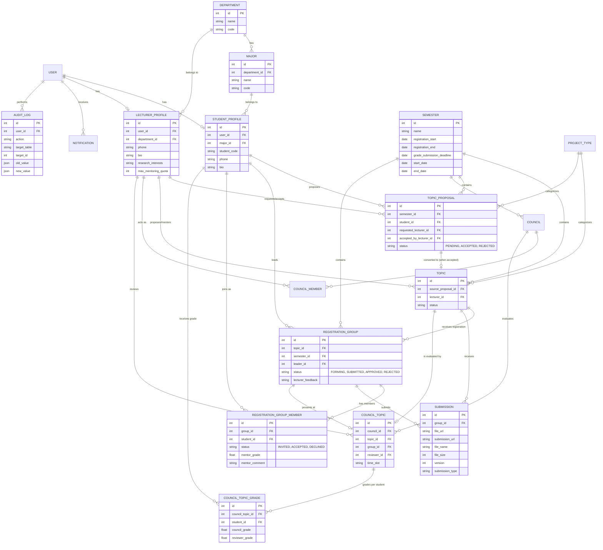

# Phân tích Thiết kế Cơ sở dữ liệu: Hệ thống Quản lý Đồ án CNTT

Hệ thống quản lý đồ án cho sinh viên Công nghệ Thông tin (bao gồm Đồ án cơ sở, Đồ án chuyên ngành, Đồ án tốt nghiệp) là một hệ thống mang tính học thuật, yêu cầu quy trình chặt chẽ từ khâu ra đề, đăng ký, thực hiện, báo cáo đến chấm điểm.

---

## 1. Phân tích Các Tính Năng Cốt Lõi (Dựa trên Role)

### 🧑‍🎓 Sinh viên (Student)

- **Quản lý đồ án**: Xem danh sách các đề tài đang mở, xem chi tiết đề tài.
- **Đăng ký**: Đăng ký đề tài cá nhân hoặc lập nhóm, mời thành viên, trưởng nhóm submit đăng ký để GV duyệt.
- **Đề xuất đề tài**: Sinh viên tự đề xuất đề tài dựa trên ý tưởng cá nhân, gửi yêu cầu cho giảng viên mong muốn hướng dẫn.
- **Thực hiện**: Quản lý tiến độ, task list, nộp báo cáo định kỳ/cuối kỳ (hỗ trợ nộp nhiều lần), nộp source code.
- **Kết quả**: Xem nhận xét của giảng viên, xem điểm, lịch bảo vệ hội đồng.

### 👨‍🏫 Giảng viên (Lecturer)

- **Quản lý đề tài**: Đề xuất đề tài mới, duyệt/từ chối sinh viên đăng ký vào đề tài của mình.
- **Duyệt đề xuất của Sinh viên**: Xem xét các đề tài do sinh viên tự đề xuất, chấp nhận làm giảng viên hướng dẫn hoặc từ chối kèm lý do.
- **Hướng dẫn**: Giao task, theo dõi tiến độ của sinh viên, tải và xem báo cáo các phiên bản.
- **Đánh giá**: Chấm điểm quá trình, nhận xét, chấm điểm phản biện/hội đồng.

### 👨‍💻 Quản trị viên (Admin)

- **Quản lý hệ thống**: Quản lý tài khoản, cấp quyền.
- **Quản lý danh mục**: Quản lý đợt/học kỳ, loại đồ án (Cơ sở, Chuyên ngành, Tốt nghiệp), bộ môn, chuyên ngành.
- **Quản lý quy trình**: Mở/đóng đợt đăng ký, duyệt đề tài của giảng viên (nếu cần), phân công hội đồng bảo vệ.
- **Báo cáo & Thống kê**: Thống kê số lượng sinh viên làm đồ án, tỉ lệ qua/trượt, danh sách điểm.

---

## 2. Thiết kế Cấu trúc Database

### Nhóm 1: Quản lý Người dùng & Phân quyền (Authentication & Profiles)

- **`users`**: `id`, `email`, `password_hash`, `role` (ADMIN, LECTURER, STUDENT), `is_active`, `created_at`, `updated_at`.
- **`student_profiles`**: `id`, `user_id` (FK), `student_code`, `full_name`, `class`, `major_id` (FK → `majors`), `cohort`, `phone`, `bio`.
  > _(cập nhật: thêm `phone`, `bio`, `major_id` FK thay cho string cứng; hỗ trợ FR_STU_01)_
- **`lecturer_profiles`**: `id`, `user_id` (FK), `lecturer_code`, `full_name`, `department_id` (FK → `departments`), `academic_title`, `phone`, `bio`, `research_interests`, `max_mentoring_quota` (Int - Số nhóm tối đa được hướng dẫn trong một học kỳ, Nullable — nếu Null thì không giới hạn).
  > _(cập nhật: thêm `phone`, `bio`, `research_interests`, `department_id` FK, `max_mentoring_quota`; hỗ trợ FR_LEC_01, FR_ADM_02)_

### Nhóm 2: Quản lý Danh mục (Master Data)

- **`semesters`**: `id`, `name`, `code`, `start_date`, `end_date`, `registration_start` (Thời điểm mở đăng ký), `registration_end` (Thời điểm đóng đăng ký), `grade_submission_deadline` (Deadline chốt điểm — sau mốc này điểm bị khóa), `is_active`.
  > _(cập nhật: thêm `registration_start`, `registration_end`; hỗ trợ FR_ADM_03)_
- **`project_types`**: `id`, `name`, `code`.
- **`departments`**: `id`, `name`, `code`. — _(bảng mới: tách riêng Khoa/Bộ môn; hỗ trợ FR_ADM_02)_
- **`majors`**: `id`, `name`, `code`, `department_id` (FK). — _(bảng mới: tách riêng Chuyên ngành; hỗ trợ FR_ADM_02)_

### Nhóm 3: Đề xuất Đề tài (Tính năng Sinh viên tự đề xuất)

Để giữ cho bảng đề tài chính thức được "sạch", chúng ta tách riêng các ý tưởng/đề xuất của sinh viên sang một bảng độc lập. Quá trình này như một bước "thương lượng".

- **`topic_proposals`**: Sinh viên đề xuất đề tài.
  - `id` (PK)
  - `semester_id` (FK) — Đề xuất thuộc học kỳ nào.
  - `student_id` (FK) — Người đề xuất.
  - `title`, `description`, `expected_outcomes`
  - `project_type_id` (FK)
  - `requested_lecturer_id` (FK - Nullable) — GV mà sinh viên mong muốn hướng dẫn (nếu để trống, GV nào trong khoa cũng có thể nhận).
  - `accepted_by_lecturer_id` (FK - Nullable) — GV chính thức duyệt và nhận hướng dẫn.
  - `status` (PENDING, ACCEPTED, REJECTED)
  - `lecturer_feedback` — Nhận xét của GV khi từ chối.
  - _Luồng xử lý_: Khi GV duyệt (`ACCEPTED`), hệ thống sẽ **tự động copy** dữ liệu tạo thành 1 record trong `topics` và tự động tạo một `registration_groups` có trạng thái `APPROVED` với chỉ **một** thành viên là sinh viên đó (trưởng nhóm).

### Nhóm 4: Quản lý Đề tài & Đăng ký (Topics & Registration)

- **`topics`**: Danh sách đề tài chính thức (được GV đề xuất hoặc GV đã duyệt từ đề xuất của SV).
  - `id` (PK), `title`, `description`, `expected_outcomes`, `project_type_id` (FK), `semester_id` (FK), `lecturer_id` (FK - GV Hướng dẫn), `max_students`, `status` (PENDING, APPROVED, OPEN, IN_PROGRESS, COMPLETED), `source_proposal_id` (FK - Nullable, liên kết ngược lại đề xuất gốc nếu có).
- **`registration_groups`**: Nhóm đăng ký đề tài (thay thế hoàn toàn `topic_registrations`).
  - `id` (PK)
  - `topic_id` (FK) — Đề tài muốn đăng ký.
  - `semester_id` (FK) — Học kỳ đăng ký.
  - `leader_id` (FK → `student_profiles`) — Trưởng nhóm (người tạo nhóm).
  - `name` (Nullable) — Tên nhóm tự đặt.
  - `status` (FORMING → SUBMITTED → APPROVED / REJECTED).
  - `lecturer_feedback` (Nullable) — Lý do từ chối của GV.
- **`registration_group_members`**: Thành viên của nhóm đăng ký.
  - `id` (PK)
  - `group_id` (FK → `registration_groups`)
  - `student_id` (FK → `student_profiles`)
  - `status` (INVITED → ACCEPTED / DECLINED) — Trưởng nhóm tự động `ACCEPTED`.
  - `mentor_grade` (Float, Nullable) — Điểm hướng dẫn (chấm riêng từng người).
  - `mentor_comment` (Text, Nullable) — Nhận xét của GV hướng dẫn.
  - `joined_at` (DateTime, Nullable) — Thời điểm SV accept lời mời.

### Nhóm 5: Quản lý Báo cáo (Submissions)

> _(Bảng `tasks` đã bị loại khỏi scope v1 — tính năng giao việc/task không cần thiết, SV/GV tự quản lý bằng công cụ ngoài.)_

- **`submissions`**: Lịch sử nộp file / báo cáo (nộp theo nhóm).
  - `id` (PK), `topic_id` (FK), `group_id` (FK → `registration_groups` - nhóm nộp bài), `submission_type` (MIDTERM, FINAL, SOURCE_CODE), `file_url` (Nullable - đường dẫn file upload), `submission_url` (Nullable - link GitHub/Drive...), `file_name`, `file_size`, `version` (Int - quản lý số lần nộp lại), `submitted_at`, `lecturer_feedback`.
  > _(cập nhật: đổi `student_id` → `group_id` — nộp bài theo nhóm, không phải cá nhân; hỗ trợ FR_STU_06, FR_LEC_04)_

### Nhóm 6: Hội đồng bảo vệ (Councils)

- **`councils`**: `id`, `name`, `semester_id` (FK), `location`, `defense_date`.
- **`council_members`**: `id`, `council_id` (FK), `lecturer_id` (FK), `council_role` (PRESIDENT, SECRETARY, REVIEWER, MEMBER).
- **`council_topics`**: Phân công nhóm vào hội đồng bảo vệ.
  - `id` (PK), `council_id` (FK), `topic_id` (FK), `group_id` (FK → `registration_groups`), `reviewer_id` (FK → `lecturer_profiles` — GV Phản biện phụ trách đề tài này), `time_slot`.
  > _(cập nhật: thêm `group_id`, `reviewer_id`; tách điểm ra bảng riêng để chấm cá nhân)_
- **`council_topic_grades`**: Điểm bảo vệ riêng cho từng sinh viên trong nhóm. _(bảng mới)_
  - `id` (PK), `council_topic_id` (FK → `council_topics`), `student_id` (FK → `student_profiles`), `council_grade` (Float, Nullable — Điểm Hội đồng), `reviewer_grade` (Float, Nullable — Điểm Phản biện).

### Nhóm 7: Thông báo hệ thống (Notifications)

- **`notifications`**: Thông báo trạng thái (GV duyệt nhóm, được mời vào nhóm, báo cáo có nhận xét mới, deadline sắp tới...).
  - `id` (PK), `user_id` (FK), `title`, `content`, `is_read`, `created_at`.

### Nhóm 8: Audit Log (Lịch sử thao tác nhạy cảm)

_(bảng mới: hỗ trợ NFR - Maintainability, yêu cầu ghi log các hành động nhạy cảm)_

- **`audit_logs`**: Ghi lại mọi hành động quan trọng của Admin và GV.
  - `id` (PK), `user_id` (FK - Ai thực hiện), `action` (Tên hành động: UPDATE_GRADE, DELETE_TOPIC...), `target_table` (Bảng bị tác động), `target_id` (ID của bản ghi bị tác động), `old_value` (JSON - Giá trị cũ), `new_value` (JSON - Giá trị mới), `created_at`.

---

## 3. Sơ đồ Thực thể Liên kết (ER Diagram)

