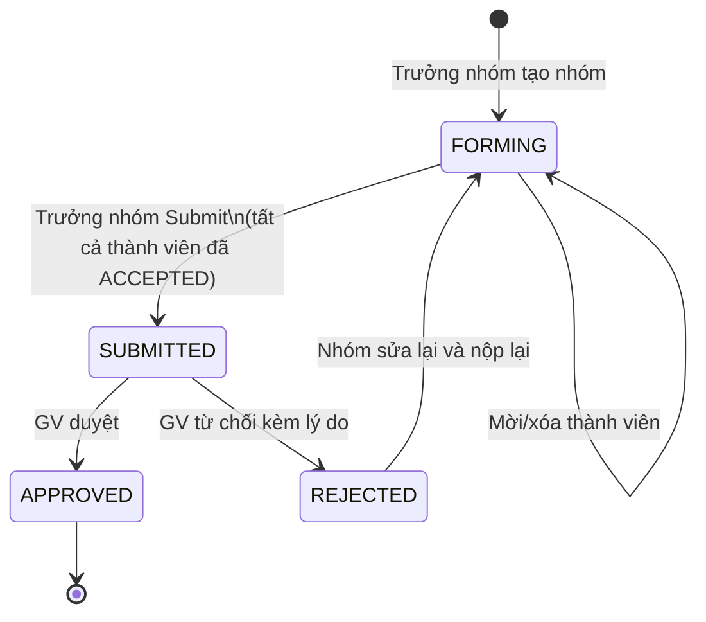

# Phân tích Tính năng Lập nhóm (Group Registration)

Tài liệu này phân tích chi tiết cách xử lý tính năng lập nhóm sinh viên trong hệ thống quản lý đồ án, đánh giá các phương án thiết kế và đưa ra khuyến nghị chuẩn product.

---

## 1. Bài toán cần giải quyết

Trong thực tế, một đề tài có thể cho phép nhiều sinh viên cùng thực hiện (đặc biệt Đồ án Tốt nghiệp thường nhóm 1–3 SV). Hệ thống cần hỗ trợ:

- Sinh viên **chủ động lập nhóm** trước khi đăng ký đề tài.
- Có cơ chế **mời thành viên** → thành viên phải đồng ý (không bị tự động thêm vào nhóm).
- Giảng viên **duyệt cả nhóm** thay vì duyệt từng người một.
- Điểm số vẫn có thể **chấm riêng từng người** trong nhóm.
- Một sinh viên **không thể tham gia 2 nhóm** đăng ký cùng một đề tài / cùng học kỳ.

---

## 2. Đánh giá các Phương án Thiết kế

### Phương án A — Không có model nhóm (Cách cũ)

**Cách làm:** Mỗi `topic_registrations` là một SV. Nhiều SV đăng ký cùng một `topic_id` = de facto nhóm.

| Ưu điểm           | Nhược điểm                                          |
| ----------------- | --------------------------------------------------- |
| Đơn giản, ít bảng | Không có trưởng nhóm                                |
| Dễ implement      | Không có cơ chế mời / từ chối                       |
|                   | GV phải duyệt từng người → không biết ai đi cùng ai |
|                   | SV không biết nhóm của mình gồm những ai            |

> ❌ **Không phù hợp** cho product thực tế. Trải nghiệm GV và SV rất kém.

---

### Phương án B — Model nhóm độc lập (Group-first)

**Cách làm:** SV lập nhóm trước (`student_groups`), sau đó nhóm đăng ký đề tài.

| Ưu điểm                                  | Nhược điểm                                             |
| ---------------------------------------- | ------------------------------------------------------ |
| Nhóm tồn tại độc lập, dùng lại nhiều lần | Phức tạp hơn cần thiết                                 |
|                                          | Sinh viên có thể có nhóm "rác" không dùng đến          |
|                                          | Nhóm không gắn liền với ngữ cảnh đăng ký → khó quản lý |

> ⚠️ **Quá phức tạp cho bài toán này.** Nhóm trong ngữ cảnh đồ án không cần tồn tại độc lập ngoài một đăng ký cụ thể.

---

### Phương án C — Registration Group Model ✅ (Khuyến nghị)

**Cách làm:** Nhóm được tạo ra **trong ngữ cảnh của một lần đăng ký đề tài cụ thể**. Không tồn tại độc lập. Đây là cách các hệ thống quản lý học thuật lớn (StackExchange, GitHub Classroom, Gradescope) tiếp cận.

> ✅ **Đây là phương án chuẩn product** — gọn nhẹ, đủ nghiệp vụ, dễ mở rộng.

---

## 3. Chi tiết Phương án C — Registration Group Model

### 3.1. Luồng hoạt động (User Flow)

```
[SV A muốn đăng ký đề tài X]
        │
        ▼
[SV A tạo "Nhóm đăng ký" → tự động là Trưởng nhóm]
        │
        ├─► [SV A mời SV B, SV C] ──► Hệ thống gửi thông báo cho B, C
        │                              B: ACCEPTED ✓
        │                              C: DECLINED ✗ → SV A mời SV D thay
        │
        ▼ (Tất cả thành viên đã ACCEPTED)
[SV A (Trưởng nhóm) chính thức "Submit" đăng ký]
        │
        ▼
[GV nhận thấy có 1 nhóm đăng ký vào đề tài X]
[GV xem danh sách thành viên + hồ sơ từng người]
        │
        ├─► APPROVED → Toàn bộ nhóm được gắn vào đề tài X
        └─► REJECTED → GV ghi lý do, nhóm có thể chỉnh sửa và đăng ký lại
```

### 3.2. Cấu trúc Database bổ sung

Thay thế hoàn toàn bảng `topic_registrations` cũ bằng 2 bảng mới:

#### Bảng `registration_groups` — Nhóm đăng ký

| Trường              | Kiểu                    | Ghi chú                                           |
| ------------------- | ----------------------- | ------------------------------------------------- |
| `id`                | PK                      |                                                   |
| `topic_id`          | FK → `topics`           | Đề tài muốn đăng ký                               |
| `semester_id`       | FK → `semesters`        | Học kỳ đăng ký                                    |
| `leader_id`         | FK → `student_profiles` | Trưởng nhóm (người tạo)                           |
| `name`              | String, Nullable        | Tên nhóm tự đặt (optional)                        |
| `status`            | Enum                    | `FORMING` → `SUBMITTED` → `APPROVED` / `REJECTED` |
| `lecturer_feedback` | Text, Nullable          | Lý do từ chối của GV                              |
| `created_at`        | DateTime                |                                                   |
| `updated_at`        | DateTime                |                                                   |

#### Bảng `registration_group_members` — Thành viên nhóm

| Trường           | Kiểu                       | Ghi chú                                |
| ---------------- | -------------------------- | -------------------------------------- |
| `id`             | PK                         |                                        |
| `group_id`       | FK → `registration_groups` |                                        |
| `student_id`     | FK → `student_profiles`    |                                        |
| `status`         | Enum                       | `INVITED` → `ACCEPTED` / `DECLINED`    |
| `mentor_grade`   | Float, Nullable            | Điểm hướng dẫn (chấm riêng từng người) |
| `mentor_comment` | Text, Nullable             | Nhận xét của GV hướng dẫn              |
| `joined_at`      | DateTime, Nullable         | Thời điểm SV accept lời mời            |

### 3.3. Các Ràng buộc nghiệp vụ quan trọng (Business Rules)

1. **Một SV chỉ được nằm trong một nhóm APPROVED cho một học kỳ** (constraint ở application layer + DB unique index).
2. **Tổng số thành viên ACCEPTED của một nhóm ≤ `topics.max_students`**.
3. **Trưởng nhóm tự động có status `ACCEPTED`** ngay khi tạo nhóm (không cần accept chính mình).
4. **Chỉ trưởng nhóm mới được** mời/xóa thành viên, và submit đăng ký.
5. **Nhóm chỉ được Submit khi tất cả thành viên đã ACCEPTED** (không còn ai đang `INVITED`).
6. **Sau khi SUBMITTED**, trưởng nhóm không thể thay đổi danh sách thành viên nếu không được GV yêu cầu sửa đổi.
7. **Khi một nhóm bị REJECTED**, status về `FORMING` để nhóm có thể sửa và Submit lại.

### 3.4. Thay đổi trong bảng `topics`

Trường `max_students` hiện tại cần được làm rõ hơn. Thực ra có 2 giá trị cần kiểm soát:

- `max_students` — Tổng số SV tối đa cho toàn đề tài.
- `max_group_size` — Số thành viên tối đa trong một nhóm (có thể config ở `project_types` hoặc ở `topics`).

> Gợi ý: Để đơn giản cho v1, chỉ cần `max_students` ở `topics`. Mỗi đề tài chỉ nhận một nhóm duy nhất → `max_students` = giới hạn nhóm.

### 3.5. Tác động lên các bảng liên quan

| Bảng                  | Thay đổi                                                                           |
| --------------------- | ---------------------------------------------------------------------------------- |
| `topic_registrations` | **Xóa hoàn toàn** — thay bằng `registration_groups` + `registration_group_members` |
| `submissions`         | Đổi `student_id` → `group_id` (nộp bài theo nhóm, không phải cá nhân)              |
| `tasks`               | Giữ `assigned_student_id` — task vẫn giao cho từng cá nhân trong nhóm              |
| `council_topics`      | Thêm `group_id` FK — hội đồng đánh giá theo nhóm                                   |
| `notifications`       | Bổ sung trigger khi bị mời vào nhóm, khi nhóm bị duyệt/từ chối                     |

---

## 4. FR bổ sung cho tính năng Lập nhóm

### Sinh viên (Student)

- **FR_STU_GRP_01:** Tạo nhóm đăng ký cho một đề tài (trở thành trưởng nhóm).
- **FR_STU_GRP_02:** Mời sinh viên khác vào nhóm theo mã SV hoặc email.
- **FR_STU_GRP_03:** Nhận thông báo khi được mời, chấp nhận hoặc từ chối lời mời.
- **FR_STU_GRP_04:** Trưởng nhóm có thể xóa thành viên đã ACCEPTED (trước khi Submit).
- **FR_STU_GRP_05:** Trưởng nhóm Submit đăng ký khi tất cả thành viên đã accept.
- **FR_STU_GRP_06:** Xem trạng thái nhóm của bản thân (Đang hình thành, Đã nộp, Đã duyệt).

### Giảng viên (Lecturer)

- **FR_LEC_GRP_01:** Xem danh sách các nhóm đã Submit đăng ký vào đề tài của mình.
- **FR_LEC_GRP_02:** Xem hồ sơ từng thành viên trong nhóm trước khi duyệt.
- **FR_LEC_GRP_03:** Duyệt (APPROVE) hoặc từ chối (REJECT) cả nhóm với lý do.
- **FR_LEC_GRP_04:** Chấm điểm hướng dẫn riêng cho từng thành viên trong nhóm.

---

## 5. Sơ đồ Trạng thái (State Machine) của Nhóm



---

## 6. Tóm tắt Khuyến nghị

| Quyết định                        | Lựa chọn                                                     |
| --------------------------------- | ------------------------------------------------------------ |
| Model                             | Registration Group (Phương án C)                             |
| Nhóm độc lập hay gắn với đăng ký? | **Gắn với đăng ký** — không tồn tại độc lập                  |
| Ai duyệt?                         | GV duyệt cả nhóm, không duyệt từng cá nhân                   |
| Điểm chấm theo ai?                | **Cá nhân** — từng thành viên có điểm riêng                  |
| Nộp bài theo ai?                  | **Nhóm** — `submissions.group_id`                            |
| Đăng ký solo?                     | Hoàn toàn được — nhóm 1 thành viên, leader = member duy nhất |
